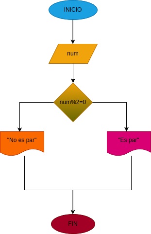

# Par_Inpar
Programa números inpar y par 

Construir un programa que lea un numero entero y que determin si se trata de un inpar o par.

## input

- Se dectara si el numero es par o inpar,
si la divicion en ese numero entre 2 el residuo es igual a 1 es inpar o sera par.

# Diseño

